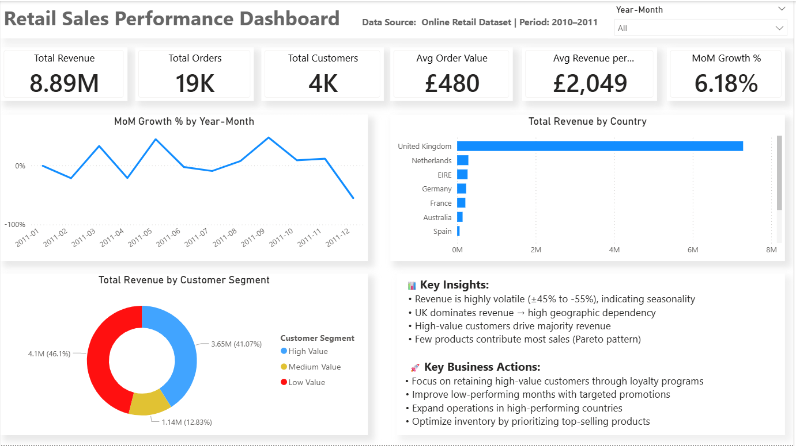
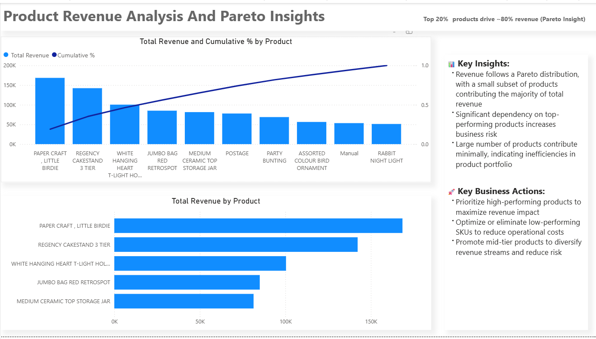
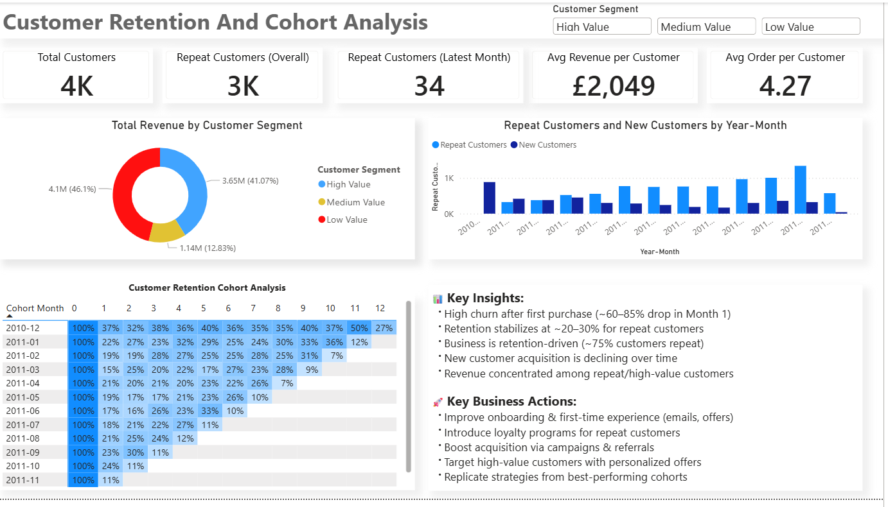
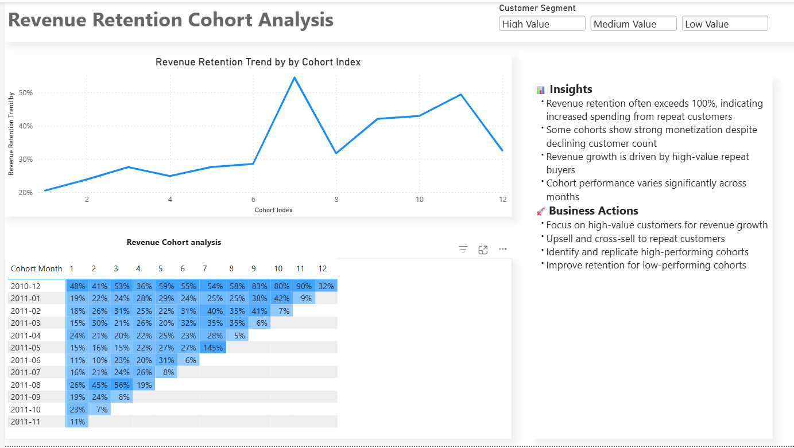
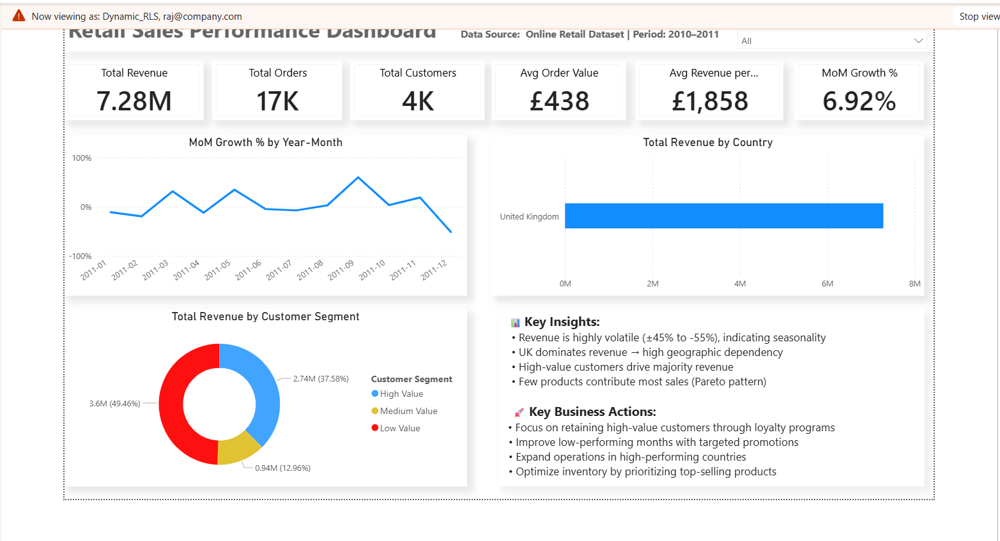

# 🛒 Retail Analytics Power BI Project

End-to-end retail analytics project using **Python, SQL, and Power BI** to generate actionable business insights.  
This project demonstrates data cleaning, transformation, analysis, and dashboard creation with **Row-Level Security (RLS)**.

---

## 📌 Project Overview

This project analyzes an online retail dataset to uncover:

- Revenue trends over time
- Customer segmentation (High / Medium / Low value)
- Product performance (Pareto Analysis)
- Customer retention & cohort behavior
- Geographic revenue distribution

---

## 🛠️ Tools & Technologies

- **Python (Pandas, Jupyter Notebook)** → Data Cleaning
- **SQL (SQL Server)** → Data Transformation & Analysis
- **Power BI** → Dashboard & Visualization
- **DAX** → Measures & KPIs
- **RLS (Row-Level Security)** → Data access control

---

## 🔄 Project Workflow

1. Data imported from Kaggle dataset  
2. Data cleaning performed in Python  
3. Cleaned data loaded into SQL Server  
4. SQL used for:
   - Data validation
   - Duplicate removal
   - KPI calculations  
5. Power BI used for:
   - Data modeling
   - Dashboard creation
   - RLS implementation  

---

## 📊 Dashboard Screenshots

### 🔹 Main Dashboard

---

### 🔹 Pareto Analysis (Top Products)

---

### 🔹 Customer Cohort Analysis

---

### 🔹 Revenue Retention Analysis

---

### 🔹 Row-Level Security (RLS)

---

## 📈 Key Insights

- Revenue shows high volatility → seasonal pattern observed  
- Majority of revenue comes from **high-value customers**  
- Small set of products drives large portion of revenue (**Pareto Principle**)  
- Customer retention drops significantly after first purchase  
- UK contributes major share → geographic dependency  

---

## 🚀 Business Recommendations

- Focus on retaining high-value customers via loyalty programs  
- Improve onboarding experience to reduce early churn  
- Optimize inventory for top-performing products  
- Expand operations beyond dominant regions  
- Use targeted campaigns for low-performing months  

---

## 🔐 Row-Level Security (RLS)

Dynamic RLS implemented using user email mapping:

- Users can only view data for their assigned country  
- Improves data security and personalization  

---

## 📂 Dataset

Dataset sourced from Kaggle:  
https://www.kaggle.com/datasets/lakshmi25npathi/online-retail-dataset

---

## 👨‍💻 Author

**Rajeev Dhami**

---

⭐ If you found this project useful, consider giving it a star!
